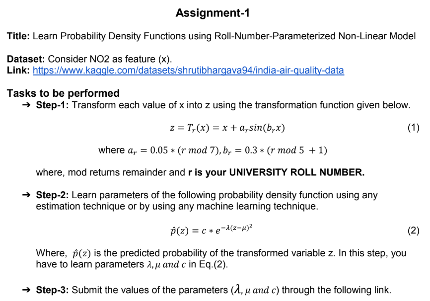

# Learn Probability Density Functions using Roll-Number-Parameterized Non-Linear Model

**Course:** Predictive Analytics using Statistics (UCS654)    
**Roll Number:** 102303759

## 1. Assignment Task



**Dataset:** India Air Quality Data - NO2 Feature  
**Source:** Kaggle Dataset - https://www.kaggle.com/datasets/shrutibhargava94/india-air-quality-data

## 2. Methodology

```
Data Loading → Transform Data (z = x + ar·sin(br·x)) → MLE Parameter Estimation → PDF Validation → Results
```

### Transformation Parameters
- University Roll Number: `102303759`
- `ar = 0.05 × (r mod 7) = 0.25`
- `br = 0.3 × (r mod 5 + 1) = 1.5`
- Transformation: `z = x + 0.25·sin(1.5·x)`

### Parameter Estimation
Maximum Likelihood Estimation (MLE) is used to estimate parameters of the probability density function:

```
p̂(z) = c · e^(-λ(z-μ)²)
```

Where:
- `λ` (lambda): Scale parameter
- `μ` (mu): Location parameter
- `c`: Normalization constant (c = √(λ/π))

## 3. Results

| Parameter | Estimated Value |
|-----------|----------------|
| **λ (lambda)** | 0.00146171 |
| **μ (mu)** | 25.818064 |
| **c** | 0.02157024 |

### Validation
- PDF Integration: ∫ p(z) dz = **0.999979 ≈ 1.0** (Successfully converged)